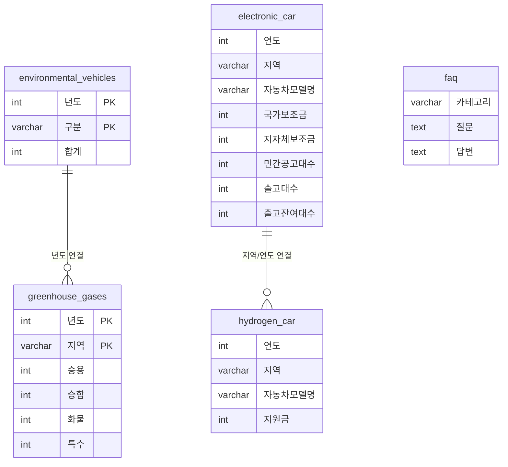

# 친환경 자동차 대시보드 ERD

## 데이터베이스: car

## 테이블 상세 설명

### 1. environmental_vehicles (친환경 자동차 등록 현황)
- **용도**: 연도별 친환경 자동차 등록 현황 데이터
- **구분 값**: '전체 차량 등록', '친환경 전체', '전기차', '수소차', '하이브리드'
- **데이터 범위**: 2020년~2024년

### 2. greenhouse_gases (온실가스 배출량)
- **용도**: 지역별/연도별 온실가스 배출량 데이터
- **지역**: 17개 시도 (강원, 경기, 경남, 경북, 광주, 대구, 대전, 부산, 서울, 세종, 울산, 인천, 전남, 전북, 제주, 충남, 충북)
- **데이터 범위**: 2019년~2022년

### 3. electronic_car (전기차 보조금 정보)
- **용도**: 전기차 보조금 및 공고/출고 현황
- **주요 정보**: 국가보조금, 지자체보조금, 민간공고대수, 출고대수, 출고잔여대수

### 4. hydrogen_car (수소차 지원금 정보)
- **용도**: 수소차 지원금 정보
- **주요 정보**: 지원금, 지역별 모델 정보

### 5. faq (FAQ 정보)
- **용도**: 기업 FAQ 질문과 답변
- **구성**: 카테고리별 분류, 질문, 답변

## 데이터 흐름

1. **메인 대시보드**: environmental_vehicles 테이블 활용
2. **환경 영향 분석**: greenhouse_gases 테이블 활용
3. **보조금 정보**: electronic_car, hydrogen_car 테이블 활용
4. **FAQ 페이지**: faq 테이블 활용 